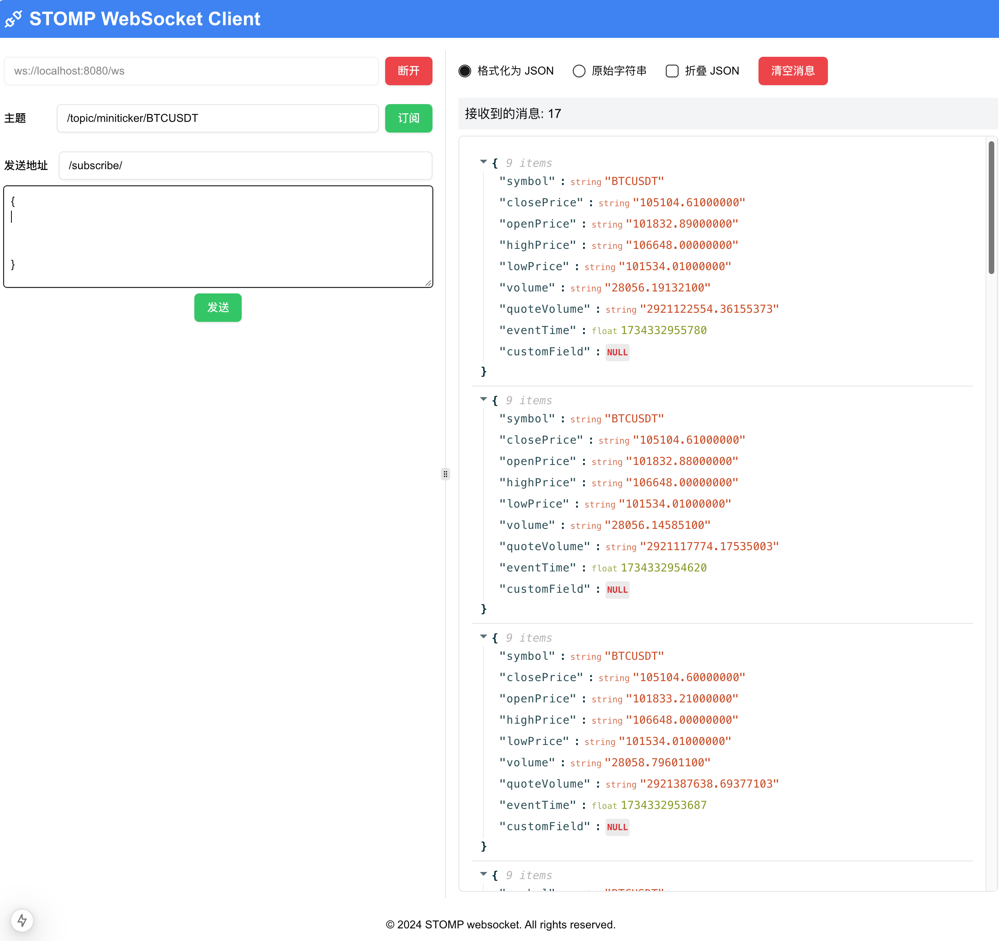

# Next.js WebSocket 应用

这是一个基于 [Next.js](https://nextjs.org) 的 WebSocket 应用程序，使用 [STOMP](https://stomp.github.io/) 协议进行消息传递。该应用允许用户连接到 WebSocket 服务器、订阅主题、发送和接收消息，并以 JSON 或原始字符串格式查看消息。

## 功能特点

- **WebSocket 连接管理**：支持连接和断开 WebSocket 服务器。
- **主题订阅**：用户可以订阅不同的主题以接收特定的消息。
- **消息发送**：用户可以发送自定义的 JSON 消息到指定的目的地。
- **消息接收**：接收到的消息可以以 JSON 格式或原始字符串格式显示。
- **消息格式化和折叠**：支持消息的格式化显示和折叠功能。

## Demo 预览地址

你可以通过以下链接查看应用的在线演示：

[https://next-websocket-app.vercel.app/](https://next-websocket-app.vercel.app/)


## 截图



## 快速开始

### 克隆项目

首先，克隆项目仓库：

```bash

pnpm install

pnpm dev

### 查看应用
打开浏览器访问 http://localhost:3000 查看应用效果。


### 许可证
本项目采用 MIT 许可证 许可。
